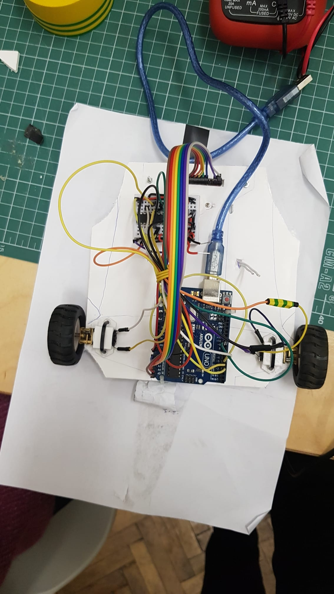
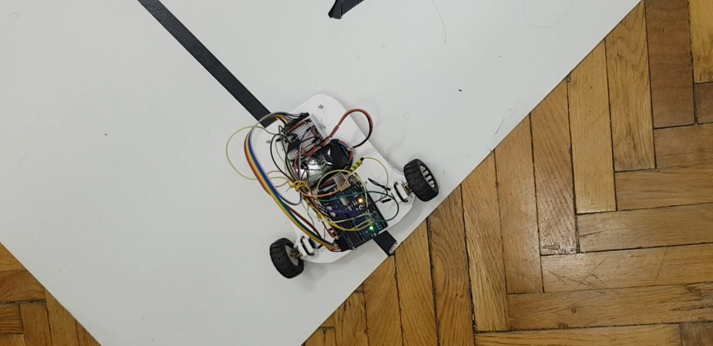

# PID-Line-Follower

This repo contains the code and the documentation for a project that was part of the "Introduction to Robotics" course at the University of Bucharest.

This was developed in a team made up of Ionescu Mircea (https://github.com/mircea-mihail), Moraru Ilinca (https://github.com/ilinca-ana-moraru) and myself (https://github.com/ioananghel).

The task for the project was to develop a line follower that would complete a course designed by the professors in as little time as possible.

The Design

The design of the robot was made using the initial plastic chassis from it's kit as a stencil. We cut out a new one from cardboard and used it to attach the components in the same way as the original.

The weight distribution was made as even as possible, with the arduino at the back of the car, between the wheels, the LiPo battery in the middle and the small breadboard was placed on top of the ball caster, before the reflectance sensors.

The motors were attached to the body using 3D printed supports that were also provided to us.

Physical Requirements

---

  <ul>
  <li>Arduino Board</li>
    <li>2x DC Motors</li>
    <li>2x Wheels</li>
    <li>Ball Caster</li>
    <li>Breadboard</li>
    <li>LiPo Battery</li>
    <li>Reflectance Sensor</li>
    <li>Zip Ties</li>
    <li>L293D Motor Driver</li>
    <li>Jumper Wires</li>
  </ul>

At the end of the project, we managed to get the robot to complete the course in 15.081 seconds. This run can also be seen in the video showcasing the functionality.

Link to the video showcasing the functionality: https://youtube.com/watch?v=Q4rl68Txs_0